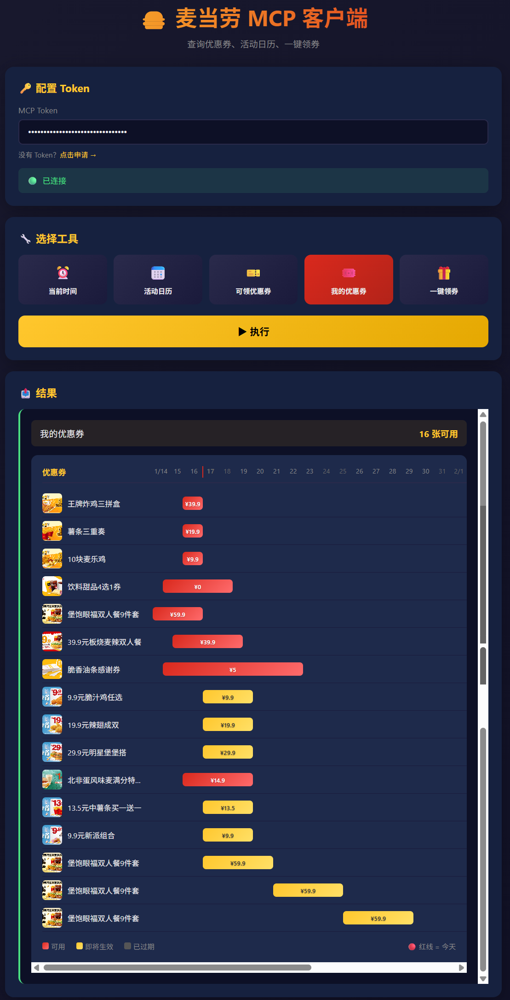
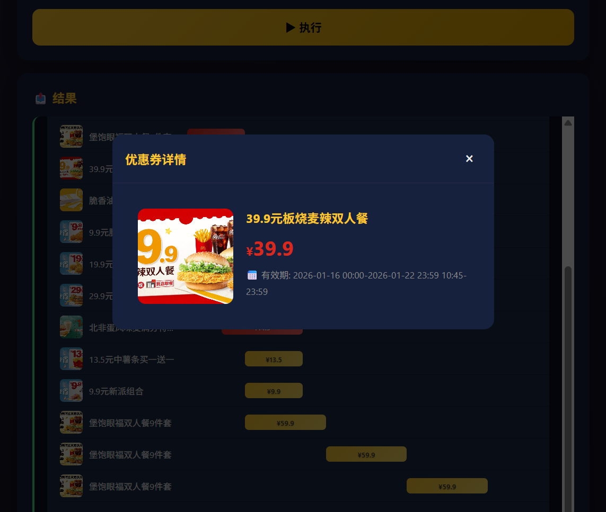

# MCD MCP WebUI

🍔 麦当劳 MCP 客户端 - 纯静态网页版

一个精美的 Web 界面，让用户通过自己的 MCP Token 访问麦当劳中国的 MCP 服务。

## 🌐 在线体验

**[👉 立即试用 Demo](https://mcd.kvapi.xyz/)**

## ✨ 功能特点

- 🎨 **精美暗色主题** - 麦当劳经典黄红配色
- 📅 **蜡笔日历** - 手绘风格标记活动日期
- 📊 **甘特图** - 可视化优惠券有效期
- 🎫 **优惠券管理** - 查询、领取优惠券
- 🔐 **用户自带 Token** - 数据安全，Token 存储在本地

## 📸 界面预览

<p align="center">
  
  
  
</p>

## 🚀 快速开始

### 获取 MCP Token

访问 [麦当劳 MCP 平台](https://open.mcd.cn/mcp/doc) 登录并申请 Token。

### 本地运行

```bash
docker compose up -d
# 访问 http://localhost:8080
```

### 部署到云端 (配合 Cloudflare Tunnel)

1. 在 [Cloudflare Zero Trust](https://one.dash.cloudflare.com/) 创建 Tunnel
2. 配置环境变量：

```bash
cp .env.example .env
# 编辑 .env 填入 CLOUDFLARE_TUNNEL_TOKEN
```

3. 启动服务：

```bash
docker compose --profile tunnel up -d
```

4. 在 Cloudflare 配置 Public Hostname 指向 `mcd-mcp:80`

## 📦 项目结构

```
mcd-mcp-webui/
├── index.html          # 主页面 (纯静态 HTML/CSS/JS)
├── nginx.conf          # Nginx 配置 (静态服务 + CORS 代理)
├── Dockerfile          # Docker 镜像 (~5MB)
├── docker-compose.yml  # Docker Compose 配置
└── .env.example        # 环境变量示例
```

## 🔧 可用工具

| 工具                   | 描述                        |
| ---------------------- | --------------------------- |
| ⏰ `now-time-info`     | 获取当前服务器时间          |
| 📅 `campaign-calender` | 查询活动日历 (蜡笔日历展示) |
| 🎫 `available-coupons` | 查询可领取的优惠券          |
| 🎟️ `my-coupons`        | 查询我的优惠券 (甘特图展示) |
| 🎁 `auto-bind-coupons` | 一键领取所有可用券          |

## 🛡️ 安全说明

- Token 仅存储在浏览器 localStorage
- 所有请求通过 nginx 代理转发
- 服务器不存储任何用户数据

## 📄 许可证

MIT
